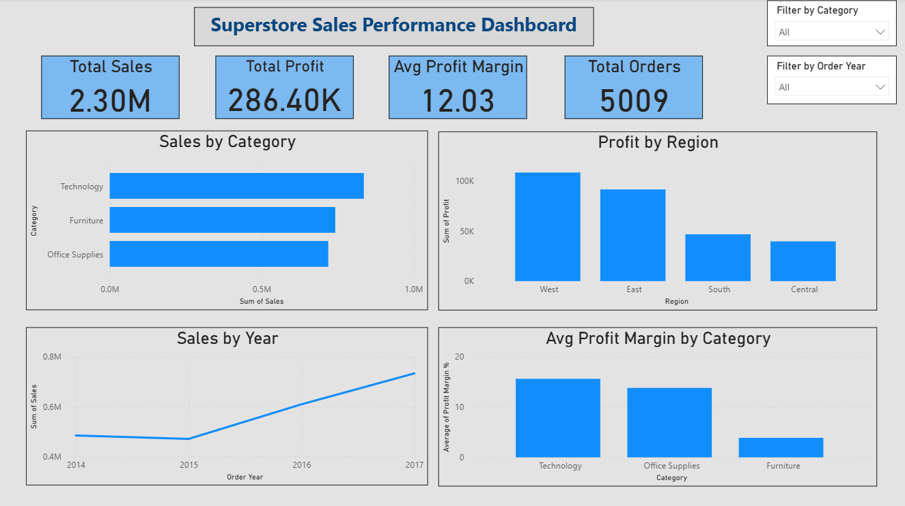

# Superstore Sales Performance Analysis & Dashboard

## Project Overview
End-to-end data analysis project analysing 9,994 sales transactions across a US retail 
superstore. Built using Python for data analysis and statistical testing, and Power BI 
for interactive dashboard development.

## Business Questions Answered
- Which product categories and regions are most/least profitable?
- Do discounts statistically significantly impact profit?
- What is the seasonal sales trend across the year?
- What drives profit margin across the business?

## Key Findings
- **Furniture has a critical margin problem** - $742K in sales but only 2.5% profit margin
- **Discounts above 20% are loss-making** - statistically proven via two-sample t-test (p < 0.0001)
- **Every 10% increase in discount rate loses $20.89 in profit** on average
- **West region is most profitable** - $108K profit vs Central's $39K on similar volumes
- **Sales grew 51% from 2014 to 2017** - consistent year-on-year growth trend
- **Peak sales month is March** - likely driven by business budget cycles

## Tools & Technologies
| Tool | Usage |
|---|---|
| Python (Pandas, NumPy) | Data cleaning, EDA, feature engineering |
| Scikit-learn | Linear regression model |
| SciPy | Hypothesis testing (t-test) |
| Matplotlib & Seaborn | Data visualisation |
| Power BI | Interactive dashboard |
| Excel | Source data |

## Statistical Analysis
### Hypothesis Test - Discount Impact on Profit
- **H0:** Discounts have no significant impact on profit
- **H1:** Discounts significantly reduce profit
- **Result:** t-statistic = -15.88, p-value ≈ 0.000
- **Conclusion:** Reject null hypothesis - discounts significantly reduce profit

### Linear Regression - Discount vs Profit
- Discount coefficient: -208.86 (every unit increase in discount = $208 loss)
- Key insight: Linear model insufficient alone — profit driven by multiple variables

## Dashboard


## Project Structure
```
superstore-sales-analysis/
│
├── Data/
│   └── Superstore.xlsx
│
├── Notebooks/
│   └── analysis.ipynb
│
├── Visuals/
│   ├── sales_overview.png
│   ├── regression.png
│   ├── seasonal_trend.png
│   └── dashboard.png
│
└── README.md
```

## How To Run
1. Clone the repository
2. Install dependencies: `pip install pandas numpy matplotlib seaborn scikit-learn scipy openpyxl`
3. Open `Notebooks/analysis.ipynb` in Jupyter
4. Run cells sequentially

## Author
**Pranali Deore**  
MSc Data Analytics — Queen Mary University of London  
[LinkedIn](https://linkedin.com/in/deorepranali)
